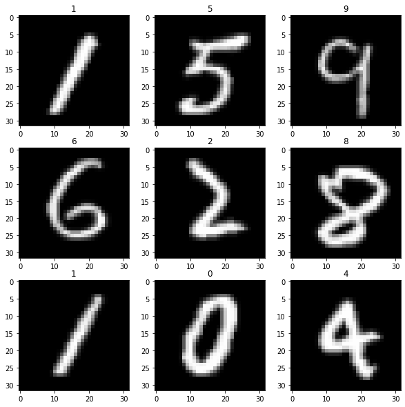
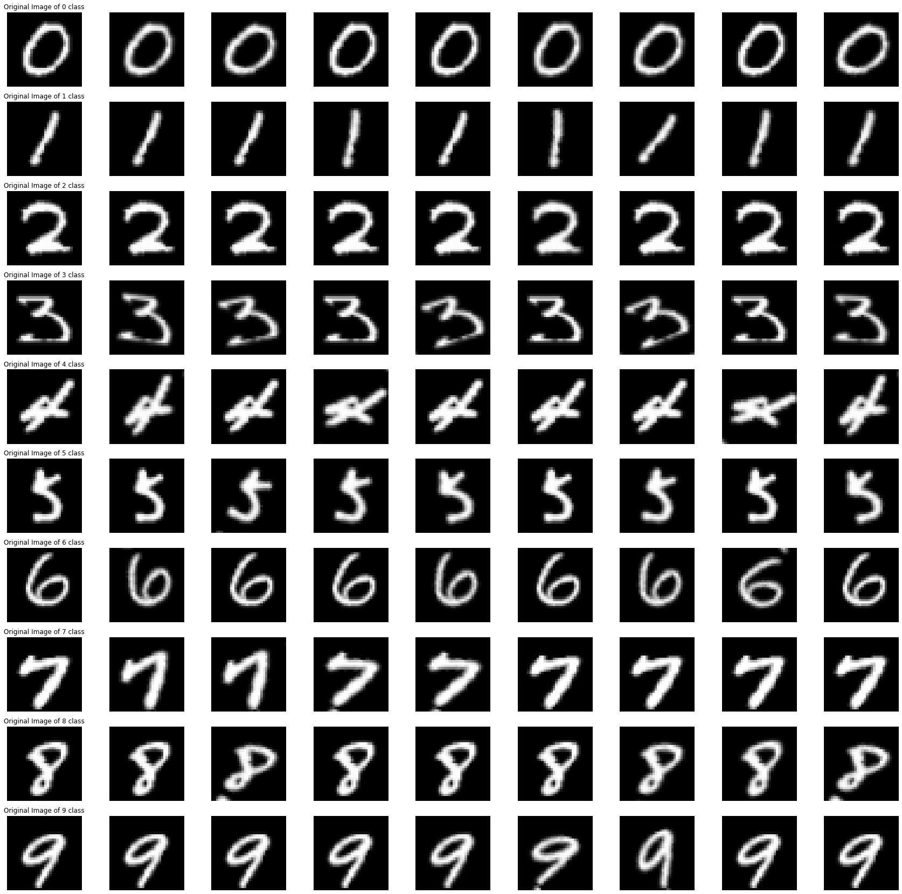
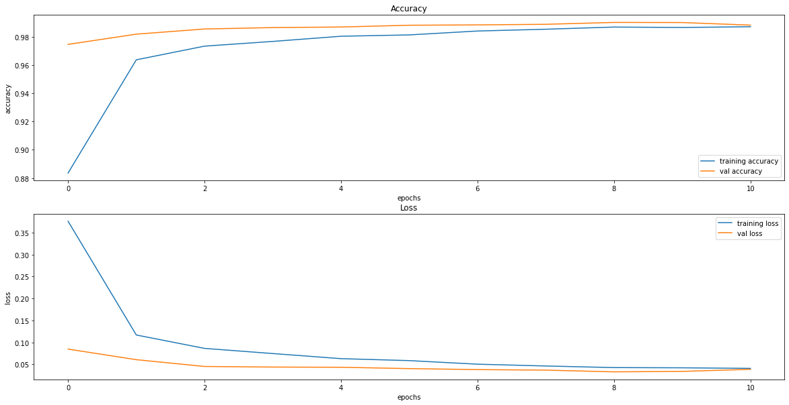

<div style="position: absolute; top: 0; right: 0;">
    <a href="ertugrulbusiness@gmail.com"></a>
    <a href="https://tr.linkedin.com/in/ertu%C4%9Fruldemir?original_referer=https%3A%2F%2Fwww.google.com%2F"></a>
    <a href="https://github.com/ertugruldmr"></a>
    <a href="https://www.kaggle.com/erturuldemir"></a>
    <a href="https://huggingface.co/ErtugrulDemir"></a>
    <a href="https://stackoverflow.com/users/21569249/ertu%c4%9frul-demir?tab=profile"></a>
    <a href="https://medium.com/@ertugrulbusiness"></a>
    <a href="https://www.youtube.com/channel/UCB0_UTu-zbIsoRBHgpsrlsA"></a>
</div>

# Black Friday Regression
 
## __Table Of Content__
- (A) [__Brief__](#brief)
  - [__Project__](#project)
  - [__Data__](#data)
  - [__Demo__](#demo) -> [Live Demo](https://ertugruldemir-mnist-imageclassifier.hf.space)
  - [__Study__](#problemgoal-and-solving-approach) -> [Colab](https://colab.research.google.com/drive/1AypKn459j93_wqgAWvvA4R6XUAmXl38c)
  - [__Results__](#results)
- (B) [__Detailed__](#Details)
  - [__Abstract__](#abstract)
  - [__Explanation of the study__](#explanation-of-the-study)
    - [__(A) Dependencies__](#a-dependencies)
    - [__(B) Dataset__](#b-dataset)
    - [__(C) Pre-processing__](#c-pre-processing)
    - [__(D) Exploratory Data Analysis__](#d-exploratory-data-analysis)
    - [__(E) Modelling__](#e-modelling)
    - [__(F) Saving the project__](#f-saving-the-project)
    - [__(G) Deployment as web demo app__](#g-deployment-as-web-demo-app)
  - [__Licance__](#license)
  - [__Connection Links__](#connection-links)

## __Brief__ 

### __Project__ 
- This is a __classification__ project that uses the  [__MNIST dataset__](https://www.tensorflow.org/datasets/catalog/mnist) to __classify the images__.
- The __goal__ is build a deep learning image classification model that accurately __classifying the images__  based on the features. 
- The performance of the model is evaluated using several __metrics__ loss and accuracy metrics.

#### __Overview__
- This project involves building a deep learning model to classfy the images. The dataset contains 70.000 (28,28,1) images with 10 class which includes from 0 to 9 numbers. 60.000 train and 10.000 test. The models selected according to model tuning results, the progress optimized respectively the previous tune results. The project uses Python and several popular libraries such as Pandas, NumPy, tensorflow.

#### __Demo__

<div align="left">
  <table>
    <tr>
    <td>
        <a target="_blank" href="https://ertugruldemir-mnist-imageclassifier.hf.space" height="30">[Demo app] HF Space</a>
      </td>
      <td>
        <a target="_blank" href="https://colab.research.google.com/drive/1-vueXyxJ6KGTWaPbcxX3CbMYlZE0A3AI">[Demo app] Run in Colab</a>
      </td>
      <td>
        <a target="_blank" href="https://github.com/ertugruldmr/MNIST_ImageClassifier/blob/main/study.ipynb">[Traning pipeline] source on GitHub</a>
      </td>
    <td>
        <a target="_blank" href="https://colab.research.google.com/drive/1AypKn459j93_wqgAWvvA4R6XUAmXl38c">[Traning pipeline] Run in Colab</a>
      </td>
    </tr>
  </table>
</div>


- Description
    - __classify the images__ .
    - __Usage__: Set the feature values through sliding the radio buttons then use the button to predict.
- Embedded [Demo](https://ertugruldemir-mnist-imageclassifier.hf.space) window from HuggingFace Space
    

<iframe
	src="https://ertugruldemir-mnist-imageclassifier.hf.space"
	frameborder="0"
	width="850"
	height="450"
></iframe>

#### __Data__
- The [__Black Friday Dataset__](https://www.kaggle.com/datasets/sdolezel/black-friday) from kaggle platform.
- The dataset contains 70.000 images (28,28,1) images with 10 class which includes from 0 to 9 numbers.
- The dataset contains the following features:


<table>
<tr><th>Data Info </th><th><div style="padding-left: 50px;">Stats</div></th></tr>
<tr><td>


tfds.core.DatasetInfo(
    name='mnist',
    full_name='mnist/3.0.1',
    description="""
    The MNIST database of handwritten digits.
    """,
    homepage='http://yann.lecun.com/exdb/mnist/',
    data_path='/root/tensorflow_datasets/mnist/3.0.1',
    file_format=tfrecord,
    download_size=11.06 MiB,
    dataset_size=21.00 MiB,
    features=FeaturesDict({
        'image': Image(shape=(28, 28, 1), dtype=uint8),
        'label': ClassLabel(shape=(), dtype=int64, num_classes=10),
    }),
    supervised_keys=('image', 'label'),
    disable_shuffling=False,
    splits={
        'test': <SplitInfo num_examples=10000, num_shards=1>,
        'train': <SplitInfo num_examples=60000, num_shards=1>,
    },
    citation="""@article{lecun2010mnist,
      title={MNIST handwritten digit database},
      author={LeCun, Yann and Cortes, Corinna and Burges, CJ},
      journal={ATT Labs [Online]. Available: http://yann.lecun.com/exdb/mnist},
      volume={2},
      year={2010}
    }""",
)


</td></tr> </table>

#### Problem, Goal and Solving approach
- This is a __Image classification__ problem  that uses the  [__MNIST dataset__](https://www.tensorflow.org/datasets/catalog/mnist)  to __classfy the number images__ into 0-10 numbers.
- The __goal__ is to build a model that accurately __classfy the number images__ into 0-10 numbers.
- __Solving approach__ is that using the supervised deep learning models.

#### Study
The project aimed predict the house prices using the features. The study includes following chapters.
- __(A) Dependencies__: Installations and imports of the libraries.
- __(B) Dataset__: Downloading and loading the dataset. Preparing the dataset via tensorflow dataset api. Configurating the dataset performance and related pre-processes.
- __(C) Modelling__: It includes .
  - Basic Modelling
    - Custom Fully Connected Deep learning models as classifier.
  - Transfer Learning
    - Adapting the state of art models into current dataset.
  - Fine-Tuning
    - Setting the hyperparams and inner params of selected layers from state of art models.
  - Model Saving
    - Saving the model architecture with weights.
- __(D) Deployment as web demo app__: Creating Gradio Web app to Demostrate the project.Then Serving the demo via huggingface as live.

#### results
- The final model is __Custom Classifier Network__ because of the results and less complexity.

| model | loss    | accuracy |
|-------|---------|----------|
| Custom Classifier | 0.03269 | 0.9904   |


## Details

### Abstract
- [__MNIST dataset__](https://www.tensorflow.org/datasets/catalog/mnist) is used to classify the number images into 0-10 number. The dataset has 70.000 records. The problem is supervised learning task as image classification. The goal is classifying the number images into number classes using  through supervised custom deep learning algorithms with transfer learning and fine-tuning approachs.The study includes creating the environment, getting the data, preprocessing the data, exploring the data, modelling the data, saving the results, deployment as demo app. Training phase of the models implemented through tensorflow callbacks. Model selection processes implemented through transfer learning and fine-tuning approachs . Selected the basic and more succesful model. Tuned __Custom Classifier Network__ model has __0.03269__ loss , __0.9904__ acc,  other metrics are also found the results section. Created a demo at the demo app section and served on huggingface space.  


### File Structures

- File Structure Tree
```bash
├── demo_app
│   ├── app.py
│   ├── BasicModel
│   │   ├── assets
│   │   ├── fingerprint.pb
│   │   ├── keras_metadata.pb
│   │   ├── saved_model.pb
│   │   └── variables
│   │       ├── variables.data-00000-of-00001
│   │       └── variables.index
│   └── sample_images
├── docs
│   └── images
├── env
│   ├── env_installation.md
│   └── requirements.txt
├── LICENSE
├── readme.md
├── requirements.txt
└── study.ipynb
```
- Description of the files
  - demo_app/
    - Includes the demo web app files, it has the all the requirements in the folder so it can serve on anywhere.
  - demo_app/component_configs.json :
    - It includes the web components to generate web page.
  - demo_app/BasicModel:
    - The trained custom fully connected neural network model.
  - demo_app/requirements.txt
    - It includes the dependencies of the demo_app.
  - docs/
    - Includes the documents about results and presentations
  - env/
    - It includes the training environmet related files. these are required when you run the study.ipynb file.
  - LICENSE.txt
    - It is the pure apache 2.0 licence. It isn't edited.
  - readme.md
    - It includes all the explanations about the project
  - study.ipynb
    - It is all the studies about solving the problem which reason of the dataset existance.    


### Explanation of the Study
#### __(A) Dependencies__:
  - The libraries which already installed on the environment are enough. You can create an environment via env/requirements.txt. Create a virtual environment then use hte following code. It is enough to satisfy the requirements for runing the study.ipynb which training pipeline.
  - Dataset can download from tensoflow.
#### __(B) Dataset__: 
  - Downloading the [__MNIST dataset__](https://www.tensorflow.org/datasets/catalog/mnist) via tensorflow dataset api. 
  - The dataset has 70.000 iamges with 10 class which includes from 0 to 9 numbers.
  - Preparing the dataset via resizing, scaling into 0-1 value range and etc image preprocessing processes.
  - Creating the tensorflow dataset object then configurating.
  - Example Dataset
      <div style="text-align: center;">
        
      </div>
  - Data Augmentation
      <div style="text-align: center;">
        
      </div>

#### __(C) Modelling__: 
  - The processes are below:
    - Basic Modelling
        <div style="text-align: center;">
          
        </div>
    - Transfer Learning
      - Implementing the state of art models into dataset.
    - Fine-Tuning
      - Model Tuning the selected model through hyperparams and inner params. 
    - Saving the project and demo studies.
     - trained model __BasicModel.sav__ as pickle format.

#### __(D) Deployment as web demo app__: 
  - Creating Gradio Web app to Demostrate the project.Then Serving the demo via huggingface as live.
  - Desciption
    - Project goal is classifiying the images into numbers.
    - Usage: upload or selec the image for classfying then use the button to predict.
  - Demo
    - The demo app in the demo_app folder as an individual project. All the requirements and dependencies are in there. You can run it anywhere if you install the requirements.txt.
    - You can find the live demo as huggingface space in this [demo link](https://ertugruldemir-mnist-imageclassifier.hf.space) as full web page or you can also us the [embedded demo widget](#demo)  in this document.  
    
## License
- This project is licensed under the Apache 2.0 License. See the [LICENSE](LICENSE) file for details.

<h1 style="text-align: center;">Connection Links</h1>

<div style="text-align: center;">
    <a href="ertugrulbusiness@gmail.com"></a>
    <a href="https://tr.linkedin.com/in/ertu%C4%9Fruldemir?original_referer=https%3A%2F%2Fwww.google.com%2F"></a>
    <a href="https://github.com/ertugruldmr"></a>
    <a href="https://www.kaggle.com/erturuldemir"></a>
    <a href="https://huggingface.co/ErtugrulDemir"></a>
    <a href="https://stackoverflow.com/users/21569249/ertu%c4%9frul-demir?tab=profile"></a>
    <a href="https://www.hackerrank.com/ertugrulbusiness"></a>
    <a href="https://app.patika.dev/ertugruldmr"></a>
    <a href="https://medium.com/@ertugrulbusiness"></a>
    <a href="https://www.youtube.com/channel/UCB0_UTu-zbIsoRBHgpsrlsA"></a>
</div>

